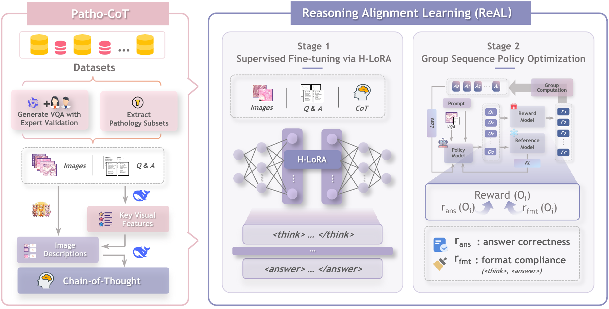
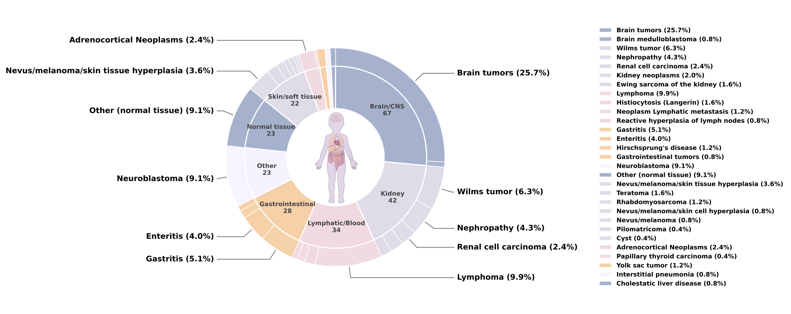

# PathLens: A Lightweight Multimodal Reasoner for In-Depth Pathology Insights

  **PathLens** is a lightweight multimodal pathological reasoner designed to deliver interpretable and efficient diagnostic reasoning. Built on HealthGPT, it avoids costly pre-training by leveraging **Patho-CoT** (a multi-agent pipeline for synthesizing Chain-of-Thought data) and **ReAL** (Reasoning Alignment Learning). Despite having only 3B parameters, PathLens achieves competitive performance against larger general-purpose models.

  

  ## 🌟 Highlights

  - **Lightweight & Efficient**: A 3B parameter model that delivers strong results with minimal computational overhead.
  - **Interpretable Reasoning**: Generates explicit "thinking" steps (`<think>...</think>`) before answering, mimicking expert diagnostic workflows.
  - **Patho-CoT Pipeline**: A novel multi-agent collaboration framework that synthesizes high-fidelity multimodal Chain-of-Thought (CoT) data.
  - **PedPathVQA Benchmark**: Introduces the first dedicated pediatric pathology VQA benchmark to evaluate domain generalization.

  ## 🛠️ Installation

  1. **Clone the repository**

     ```bash
     git clone https://github.com/hovchen/PathLens.git
     cd PathLens
     ```

  2. **Install dependencies**

     ```bash
     pip install -r requirements.txt
     ```

  ## 🚀 Quick Start

  We provide scripts for model inference. You will need the pre-trained PathLens weights ([hlora_weights]() and [vocab_proj_weights]()),  pre-trained [Phi-3 LLM](https://huggingface.co/microsoft/Phi-3-mini-4k-instruct) and the [CLIP visual encoder](https://huggingface.co/openai/clip-vit-large-patch14-336).

  ### Inference

  Use the provided shell script `scripts/infer.sh` or run the python script directly.

  **Using Shell Script:** Edit scripts/infer.sh to point to your model paths, then run:

  ```bash
bash scripts/infer.sh
  ```

  **Using Python Command:**

  ```bash
CUDA_VISIBLE_DEVICES=0,1,2,3 python3 scripts/infer.py \
    --model_name_or_path "microsoft/Phi-3-mini-4k-instruct" \
    --vit_path "openai/clip-vit-large-patch14-336" \
    --hlora_path "path/to/hlora_weights" \
    --vocab_proj_path "path/to/vocab_proj_weights" \
    --img_path "examples/demo.png" \
    --question "What is the condition of the interstitial in the image?" \
    --hlora_r 64 \
    --hlora_alpha 128 \
    --infer
  ```

  **Arguments:**

  - `--model_name_or_path`: Path to the base LLM (Phi-3-mini-4k-instruct).
  - `--vit_path`: Path to the CLIP vision tower.
  - `--hlora_path`: Path to the PathLens LoRA weights.
  - `--img_path`: Path to the input image.
  - `--question`: The clinical question to ask.

  ## 📊 Results

  PathLens demonstrates superior performance across multiple benchmarks compared to models of similar (and often larger) size.

| **Model**       | **PathVQA (Acc)** | **PathMMU-Val (Acc)** | **PedPathVQA (Acc)** |
| --------------- | ----------------- | --------------------- | -------------------- |
| **PathLens-3B** | **53.2**          | **61.3**              | **56.9**             |
| Patho-R1-3B     | 41.9              | 58.4                  | 53.36                |
| HealthGPT-M3    | 51.7              | 49.4                  | 41.90                |
| Qwen2.5-VL-7B   | 44.1              | 38.4                  | 53.75                |

  *See [Table 1], [Table 2], [Table 3], and [Table 4] in the paper for full comparisons.*

  ## 📂 Datasets

  We introduce **PedPathVQA**, a dataset focused on pediatric histopathology, covering brain tumors, kidney neoplasms, and lymphomas. This benchmark is used to assess cross-domain generalization.

  

  > **Note**: The **PedPathVQA** dataset will be made publicly available upon the paper's acceptance. Currently, it is available for research purposes upon request. Please contact the corresponding authors (Feiwei Qin: `qinfeiwei@hdu.edu.cn` or Gang Yu: `yugbme@zju.edu.cn`) for access.

  ## 📜 License

  This project is licensed under the [Apache License 2.0](https://www.google.com/search?q=./LICENSE).

  ## 🤝 Acknowledgment

  Our project is developed based on the following repositories:

- [LLaVA](https://github.com/haotian-liu/LLaVA): Large Language and Vision Assistant
- [LLaVA++](https://github.com/mbzuai-oryx/LLaVA-pp): Extending Visual Capabilities with LLaMA-3 and Phi-3
- [HealthGPT](https://github.com/DCDmllm/HealthGPT): A Medical Large Vision-Language Model for Unifying Comprehension and Generation via Heterogeneous Knowledge Adaptation

## 🖊️ Citation

If you use PathLens in your research, please cite our paper:

```tex
@article{zhu2026pathlens,
  title={PathLens: A Lightweight Multimodal Reasoner for In-Depth Pathology Insights},
  author={Zhu, Zhu and Chen, Huangwei and Yan, Zhenyu and Zhang, Donghao and Wu, Yueyi and Zhan, Yuqi and Cheng, Weihao and Zhao, Manli and Gu, Weizhong and Chen, Yifei and Qin, Feiwei and Yu, Gang},
  year={2026}
}
```

